# Cyclistic bike-share case study - Google Data Analytics Capstone Project

This case study is proposed on the course "Google Data Analytics Professional Certificate" offered on Coursera. I followed the steps of the analysis process as I've learned during the course, that consist in six phases: 1) ask, 2) prepare, 3) process, 5) analyze, 6) share, 6) act.

Before to start with the analysis, I want to thank you all for your interest and invite you to share your thaughts about this work.

### Scenario

In 2016 the fictional company Cyclistic launched his successful bike-share offering service. The current marketing strategy relies on building general awareness and appealing to broad customer segments, also thanks to the flexibility of the pricing plans, by which it's possible to identify "casual riders", who purchase single-ride or full-day passes, and "Cyclistic members", who purchase annual membership.

In this context, financial analysts of the company have concluded that annual members are much more profitable than casual riders. In addition, the marketing department led by Lily Moreno suggest that there is an opportunity to convert casual riders into annual members, rather than targeting all-new customers. In order to achieve this goal is necessary to understand how annual members and casual riders differ, why casual riders would buy a membership, and how digital media could affect their marketing tactics. 

The director of the marketing department has assigned to me the first one of these tasks: understand how annual member and casual riders use the service offered by Cyclistic differently.

## 1) Ask

### Business task

The aim of this analysis it's focused on understanding the differences in the use of the Cyclistic's services betweeen annual members and casual riders.
Identifying trends will help the marketing department to design marketing strategies in order to convert casual riders into annual members.

### Key stakeholders

1) Lily Moreno:
   She is the director of the marketing department, responsible for the development of campaigns and initiatives to promote the bike-share program, including email, social media and other channels.
   She is the primary stakeholder of this project, because she will use the findings of all the analysis to make new decisions.
2) The Cyclistic marketing analytics team:
   A team of data analysts who are responsible for collecting, analyzing and reporting data that helps guide Cyclistic marketing strategy.
   They are secondary stakeholders, because they depend on my work for their own tasks.
3) The Cyclistic executive team:
   The detail-oriented executive team that will decide whether to approve the recommended marketing program. 

## 2) Prepare

### Location of the data

The data are stored in this [server](https://divvy-tripdata.s3.amazonaws.com/index.html); the dataset have a different name because Cyclistic is a fictional company.

### Organization of the data

The data are organized and updated monthly. This means that I will need to download 12 datasets and merge them into a single dataset in order to obtain an annual table . Every monthly dataset presents the same organization, in fact the data are classified according to the same attributes:

- ride_id
- rideable_type
- started_at
- ended_at
- start_station_name
- start_station_id
- end_station_name
- end_station_id
- start_lat
- start_lng
- end_lat
- end_lng
- member_casual

### Verify R.O.C.C.C.

The acronym R.O.C.C.C. summarize the process to identify the good (or bad) quality of a dataset.
In fact, R.O.C.C.C. stands for Reliable, Original, Comprehensive, Current, Cited.
In this specific case: 
- data are sufficiently **Reliable** because they are mostly accurate; there is a certain number of null values, so is not complete.
- as first-party data, they are **originals** by definition. 
- The datasets are enough **comprehensive**; it is possible to answer the questions asked quite exhaustively. The comprehensiveness could have been better with at least anonyms identifiers of the riders, in order to understand if and how many bike trips are made by the same users.
- Data are absolutely **current** for this kind of analysis, because are provided in the past 12 months.
- Data are **cited**, because they are provided by a real company (Divvy), and owned by the City of Chicago and made available by Motivational International Inc.

### Adressing licencing, privacy, security and accessibility

Data are made available by Motivational International Inc under this [license](https://divvybikes.com/data-license-agreement) that allows to perform the analysis and show the results. There aren't private data, so the use of these datasets is secure from a privacy-protection point of view. Theoretically, in a real analysis data would be stored in a secure location with restricted access, especially with personal and sensitive data.


### Data integrity

In this phase I've only verified the consistency of the attributes. In the next phase it will be conducted a data cleaning process in which tasks such as in-depht inspections, filling of missing data, identification of potential errors, ensuring consistency and the correct data type will be performed.

### Relevance of the data

The available data are useful to gain insight capable of providing a sufficiently comprehensive answer to the question asked. In particular, from the observations about the registered trips it is possible to distinguish if the rider is a member or a casual user, the dates and places of start and arrival, and the bike type used.

### Problems and limitations

Data-privacy issues prohibit the use of riders' personally identifiable information; for this reason is not possible to connect pass purchase to credit card numbers to determine if casual riders live in the Cyclistic service area or they have purchased multiple single passes.
Furthemore the datasets present several null values, especially concerning the names and identifiers of the start and end stations.
Finally, as mentioned above, it's not possible to understand if and how many bike trips are made by the same users; this could have been useful to better understand the usage habits of the service and any differences between the types of users.

## 3) Process

### Tools used for cleaning and analysing

I choose to use SQL on BigQuery for the cleaning and analysis processes. SQL it's a tool that let me work with large datasets, with which it is difficult to use spreadsheets softwares, due to the large number of rows. With SQL, instead, I can unify the monthly dataset in an annual one, apply the data cleaning process and perform the analysis in a single environment.

After the dataset is created and uploated the 12 monthly table on BigQuery, I can start the data transformation process that will allow me to perform the analysis effectively.

### Creating one table with the annual data

<details>
   <summary>Display SQL Query</summary>

   ```SQL

   -- merging the 12 monthly tables into one; new table saved as "cyclistic_annual"

CREATE TABLE
  `sigma-nimbus-418114.bike_sharing_1.cyclistic_annual`
AS (
SELECT 
  *
FROM
  `sigma-nimbus-418114.bike_sharing_1.03_2023`
  UNION ALL
SELECT
  *
FROM
  `sigma-nimbus-418114.bike_sharing_1.04_2023`
  UNION ALL
SELECT
  *
FROM
  `sigma-nimbus-418114.bike_sharing_1.05_2023`
  UNION ALL
SELECT
  *
FROM
  `sigma-nimbus-418114.bike_sharing_1.06_2023`
 UNION ALL
SELECT
  *
FROM
  `sigma-nimbus-418114.bike_sharing_1.07_2023`
  UNION ALL
SELECT
  *
FROM
  `sigma-nimbus-418114.bike_sharing_1.08_2023`
 UNION ALL
SELECT
  *
FROM
  `sigma-nimbus-418114.bike_sharing_1.09_2023`
 UNION ALL
SELECT
  *
FROM
  `sigma-nimbus-418114.bike_sharing_1.10_2023`
 UNION ALL
SELECT
  *
FROM
  `sigma-nimbus-418114.bike_sharing_1.11_2023`
 UNION ALL
SELECT
  *
FROM
  `sigma-nimbus-418114.bike_sharing_1.12_2023`
 UNION ALL
SELECT
  *
FROM
  `sigma-nimbus-418114.bike_sharing_1.01_2024`
 UNION ALL
SELECT
  *
FROM
  `sigma-nimbus-418114.bike_sharing_1.02_2024`)
```
</details>

In this way I obtained a single table called "cyclistic_annual" with all the trip data

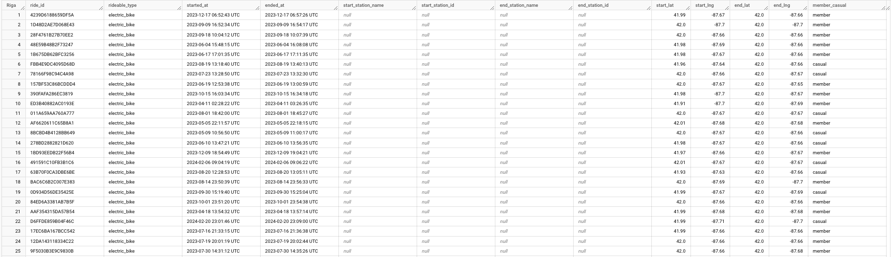


### Ensuring data integrity

#### Check for duplicate, nulls, invalid and misplaced values

<details>
   <summary>Display SQL Query</summary>

   ```SQL
-- obtaining a tidy table in order to check duplicate values, null, inspect values in dates and type of user columns

SELECT 'total_rows' AS metric, COUNT(*) AS count_value
FROM `sigma-nimbus-418114.bike_sharing_1.cyclistic_annual`
UNION ALL
SELECT 'unique_values' AS metric, COUNT(DISTINCT ride_id) AS count_value
FROM `sigma-nimbus-418114.bike_sharing_1.cyclistic_annual`
UNION ALL
SELECT 'ride_id_null' AS metric, COUNTIF(ride_id IS NULL) AS count_value
FROM `sigma-nimbus-418114.bike_sharing_1.cyclistic_annual`
UNION ALL
SELECT 'rideable_type_null' AS metric, COUNTIF(rideable_type IS NULL) AS count_value
FROM `sigma-nimbus-418114.bike_sharing_1.cyclistic_annual`
UNION ALL
SELECT 'started_at_null' AS metric, COUNTIF(started_at IS NULL) AS count_value
FROM `sigma-nimbus-418114.bike_sharing_1.cyclistic_annual`
UNION ALL
SELECT 'ended_at_null' AS metric, COUNTIF(ended_at IS NULL) AS count_value
FROM `sigma-nimbus-418114.bike_sharing_1.cyclistic_annual`
UNION ALL
SELECT 'start_station_name_null' AS metric, COUNTIF(start_station_name IS NULL) AS count_value
FROM `sigma-nimbus-418114.bike_sharing_1.cyclistic_annual`
UNION ALL
SELECT 'start_station_id_null' AS metric, COUNTIF(start_station_id IS NULL) AS count_value
FROM `sigma-nimbus-418114.bike_sharing_1.cyclistic_annual`
UNION ALL
SELECT 'end_station_name_null' AS metric, COUNTIF(end_station_name IS NULL) AS count_value
FROM `sigma-nimbus-418114.bike_sharing_1.cyclistic_annual`
UNION ALL
SELECT 'end_station_id_null' AS metric, COUNTIF(end_station_id IS NULL) AS count_value
FROM `sigma-nimbus-418114.bike_sharing_1.cyclistic_annual`
UNION ALL
SELECT 'start_lat_null' AS metric, COUNTIF(start_lat IS NULL) AS count_value
FROM `sigma-nimbus-418114.bike_sharing_1.cyclistic_annual`
UNION ALL
SELECT 'start_lng_null' AS metric, COUNTIF(start_lng IS NULL) AS count_value
FROM `sigma-nimbus-418114.bike_sharing_1.cyclistic_annual`
UNION ALL
SELECT 'end_lat_null' AS metric, COUNTIF(end_lat IS NULL) AS count_value
FROM `sigma-nimbus-418114.bike_sharing_1.cyclistic_annual`
UNION ALL
SELECT 'end_lng_null' AS metric, COUNTIF(end_lng IS NULL) AS count_value
FROM `sigma-nimbus-418114.bike_sharing_1.cyclistic_annual`
UNION ALL
SELECT 'member_casual_null' AS metric, COUNTIF(member_casual IS NULL) AS count_value
FROM `sigma-nimbus-418114.bike_sharing_1.cyclistic_annual`
UNION ALL
SELECT 'member_causal_values' AS metric, COUNT(DISTINCT member_casual) AS count_value
FROM `sigma-nimbus-418114.bike_sharing_1.cyclistic_annual`
UNION ALL
SELECT 'count_wrong_dates' AS metric, COUNTIF(ended_at <= started_at) AS count_value
FROM `sigma-nimbus-418114.bike_sharing_1.cyclistic_annual`
ORDER BY
  CASE 
  WHEN metric = 'total_rows' THEN 1
  WHEN metric = 'unique_values' THEN 2
  WHEN metric = 'ride_id_null' THEN 3
  WHEN metric = 'rideable_type_null' THEN 4
  WHEN metric = 'started_at_null' THEN 5
  WHEN metric = 'ended_at_null' THEN 6
  WHEN metric = 'count_wrong_dates' THEN 7
  WHEN metric = 'start_station_name_null' THEN 8
  WHEN metric = 'start_station_id_null' THEN 9
  WHEN metric = 'end_station_name_null' THEN 10
  WHEN metric = 'end_station_id_null' THEN 11
  WHEN metric = 'start_lat_null' THEN 12
  WHEN metric = 'start_lng_null' THEN 13
  WHEN metric = 'end_lat_null' THEN 14
  WHEN metric = 'end_lng_null' THEN 15
  WHEN metric = 'member_casual_null' THEN 16
  WHEN metric = 'member_causal_values' THEN 17
  END

```

</details>

I get the following table:

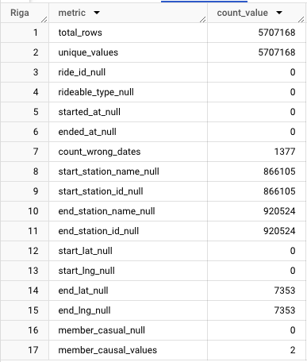

The results show that the trip identifiers are all unique, because are equal to the number of rows; there is a small number of misplaced dates, but above all a certain number of null values, especially in the columns that cointain the names and identifiers of the start and end stations. Finally there aren't wrong values in the column that cointains the type of user.

#### Data cleaning

I decided to create a new table in which I will not consider the rows with null values and misplaced dates.
In addition, I want to separate the elements of the dates in years, months, days, days of the week, assign a value that allow me to identify easily the season and the part of the day, and add a column that cointains the duration of the trip that I can calculate using the start time and the end time.

<details><summary>Display SQL Query</summary>
   
   ```SQL
-- obtaining a new table with data cleaned.

CREATE TABLE
  `sigma-nimbus-418114.bike_sharing_1.cyclistic_cleaned`
AS ( 
SELECT
  *,
  DATE_DIFF(ended_at,started_at, minute) AS travel_time, -- trip duration
  EXTRACT(YEAR FROM started_at) AS year,
  EXTRACT(MONTH FROM started_at) AS month,
  EXTRACT(DAY FROM started_at) AS day,
  EXTRACT(DAYOFWEEK FROM started_at) AS day_of_week,
  EXTRACT(HOUR FROM started_at) AS hour,
  CASE -- to assign a season depending on the month 
    WHEN EXTRACT(MONTH FROM started_at) BETWEEN 3 AND 5 THEN 'Spring'
    WHEN EXTRACT(MONTH FROM started_at) BETWEEN 6 AND 8 THEN 'Summer'
    WHEN EXTRACT(MONTH FROM started_at) BETWEEN 9 AND 11 THEN 'Fall'
    ELSE 'Winter'
  END AS season,
  CASE -- to assign a part of the day depending on the hour
    WHEN EXTRACT(HOUR FROM started_at) >= 6 AND EXTRACT(HOUR FROM started_at) < 12 THEN 'Morning'
    WHEN EXTRACT(HOUR FROM started_at) >= 12 AND EXTRACT(HOUR FROM started_at) < 18 THEN 'Afternoon'
    WHEN EXTRACT(HOUR FROM started_at) >= 18 AND EXTRACT(HOUR FROM started_at) < 24 THEN 'Evening'
    ELSE 'Night'
  END AS part_of_day
FROM
  `sigma-nimbus-418114.bike_sharing_1.cyclistic_annual`
WHERE -- filter to extract clean data
  started_at < ended_at AND
  start_station_name IS NOT NULL 
  AND start_station_id IS NOT NULL
  AND end_station_name IS NOT NULL
  AND end_station_id IS NOT NULL
  AND end_lat IS NOT NULL
  AND end_lng IS NOT NULL)
  ```
</details>

In this way I get the table "cyclistic_cleaned"; the analysis will be performed on this clean dataset.

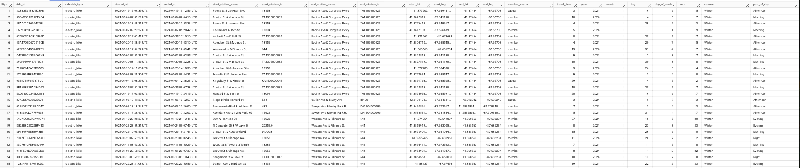

To verify that the data is clean and correct I set a last check before proceeding with the analysis.

<details><summary>Display SQL Query</summary>
   
   ```SQL

-- obtaining a tidy table in order to inspect if in the new dataset "cyclistic_cleaned" there are duplicate values, null, incorrect or misplaced values.

SELECT 'total_rows' AS metric, COUNT(*) AS count_value
FROM `sigma-nimbus-418114.bike_sharing_1.cyclistic_cleaned`
UNION ALL
SELECT 'unique_values' AS metric, COUNT(DISTINCT ride_id) AS count_value
FROM `sigma-nimbus-418114.bike_sharing_1.cyclistic_cleaned`
UNION ALL
SELECT 'ride_id_null' AS metric, COUNTIF(ride_id IS NULL) AS count_value
FROM `sigma-nimbus-418114.bike_sharing_1.cyclistic_cleaned`
UNION ALL
SELECT 'rideable_type_null' AS metric, COUNTIF(rideable_type IS NULL) AS count_value
FROM `sigma-nimbus-418114.bike_sharing_1.cyclistic_cleaned`
UNION ALL
SELECT 'started_at_null' AS metric, COUNTIF(started_at IS NULL) AS count_value
FROM `sigma-nimbus-418114.bike_sharing_1.cyclistic_cleaned`
UNION ALL
SELECT 'ended_at_null' AS metric, COUNTIF(ended_at IS NULL) AS count_value
FROM `sigma-nimbus-418114.bike_sharing_1.cyclistic_cleaned`
UNION ALL
SELECT 'start_station_name_null' AS metric, COUNTIF(start_station_name IS NULL) AS count_value
FROM `sigma-nimbus-418114.bike_sharing_1.cyclistic_cleaned`
UNION ALL
SELECT 'start_station_id_null' AS metric, COUNTIF(start_station_id IS NULL) AS count_value
FROM `sigma-nimbus-418114.bike_sharing_1.cyclistic_cleaned`
UNION ALL
SELECT 'end_station_name_null' AS metric, COUNTIF(end_station_name IS NULL) AS count_value
FROM `sigma-nimbus-418114.bike_sharing_1.cyclistic_cleaned`
UNION ALL
SELECT 'end_station_id_null' AS metric, COUNTIF(end_station_id IS NULL) AS count_value
FROM `sigma-nimbus-418114.bike_sharing_1.cyclistic_cleaned`
UNION ALL
SELECT 'start_lat_null' AS metric, COUNTIF(start_lat IS NULL) AS count_value
FROM `sigma-nimbus-418114.bike_sharing_1.cyclistic_cleaned`
UNION ALL
SELECT 'start_lng_null' AS metric, COUNTIF(start_lng IS NULL) AS count_value
FROM `sigma-nimbus-418114.bike_sharing_1.cyclistic_cleaned`
UNION ALL
SELECT 'end_lat_null' AS metric, COUNTIF(end_lat IS NULL) AS count_value
FROM `sigma-nimbus-418114.bike_sharing_1.cyclistic_cleaned`
UNION ALL
SELECT 'end_lng_null' AS metric, COUNTIF(end_lng IS NULL) AS count_value
FROM `sigma-nimbus-418114.bike_sharing_1.cyclistic_cleaned`
UNION ALL
SELECT 'member_casual_null' AS metric, COUNTIF(member_casual IS NULL) AS count_value
FROM `sigma-nimbus-418114.bike_sharing_1.cyclistic_cleaned`
UNION ALL
SELECT 'member_causal_values' AS metric, COUNT(DISTINCT member_casual) AS count_value
FROM `sigma-nimbus-418114.bike_sharing_1.cyclistic_cleaned`
UNION ALL
SELECT 'count_wrong_dates' AS metric, COUNTIF(ended_at <= started_at) AS count_value
FROM `sigma-nimbus-418114.bike_sharing_1.cyclistic_cleaned`
UNION ALL
SELECT 'unique_hour' AS metric, COUNT(DISTINCT hour) AS count_value
FROM `sigma-nimbus-418114.bike_sharing_1.cyclistic_cleaned`
UNION ALL
SELECT 'hour_null' AS metric, COUNTIF(hour IS NULL) AS count_value
FROM `sigma-nimbus-418114.bike_sharing_1.cyclistic_cleaned`
UNION ALL
SELECT 'unique_day' AS metric, COUNT(DISTINCT day) AS count_value
FROM `sigma-nimbus-418114.bike_sharing_1.cyclistic_cleaned`
UNION ALL
SELECT 'day_null' AS metric, COUNTIF(day IS NULL) AS count_value
FROM `sigma-nimbus-418114.bike_sharing_1.cyclistic_cleaned`
UNION ALL
SELECT 'unique_day_week' AS metric, COUNT(DISTINCT day_of_week) AS count_value
FROM `sigma-nimbus-418114.bike_sharing_1.cyclistic_cleaned`
UNION ALL
SELECT 'day_week_null' AS metric, COUNTIF(day_of_week IS NULL) AS count_value
FROM `sigma-nimbus-418114.bike_sharing_1.cyclistic_cleaned`
UNION ALL
SELECT 'unique_part_day' AS metric, COUNT(DISTINCT part_of_day) AS count_value
FROM `sigma-nimbus-418114.bike_sharing_1.cyclistic_cleaned`
UNION ALL
SELECT 'part_day_null' AS metric, COUNTIF(part_of_day IS NULL) AS count_value
FROM `sigma-nimbus-418114.bike_sharing_1.cyclistic_cleaned`
UNION ALL
SELECT 'unique_month' AS metric, COUNT(DISTINCT month) AS count_value
FROM `sigma-nimbus-418114.bike_sharing_1.cyclistic_cleaned`
UNION ALL
SELECT 'month_null' AS metric, COUNTIF(month IS NULL) AS count_value
FROM `sigma-nimbus-418114.bike_sharing_1.cyclistic_cleaned`
UNION ALL
SELECT 'unique_season' AS metric, COUNT(DISTINCT season) AS count_value
FROM `sigma-nimbus-418114.bike_sharing_1.cyclistic_cleaned`
UNION ALL
SELECT 'season_null' AS metric, COUNTIF(season IS NULL) AS count_value
FROM `sigma-nimbus-418114.bike_sharing_1.cyclistic_cleaned`
UNION ALL
SELECT 'unique_year' AS metric, COUNT(DISTINCT year) AS count_value
FROM `sigma-nimbus-418114.bike_sharing_1.cyclistic_cleaned`
UNION ALL
SELECT 'year_null' AS metric, COUNTIF(year IS NULL) AS count_value
FROM `sigma-nimbus-418114.bike_sharing_1.cyclistic_cleaned`
ORDER BY
  CASE 
  WHEN metric = 'total_rows' THEN 1
  WHEN metric = 'unique_values' THEN 2
  WHEN metric = 'ride_id_null' THEN 3
  WHEN metric = 'rideable_type_null' THEN 4
  WHEN metric = 'started_at_null' THEN 5
  WHEN metric = 'ended_at_null' THEN 6
  WHEN metric = 'count_wrong_dates' THEN 7
  WHEN metric = 'start_station_name_null' THEN 8
  WHEN metric = 'start_station_id_null' THEN 9
  WHEN metric = 'end_station_name_null' THEN 10
  WHEN metric = 'end_station_id_null' THEN 11
  WHEN metric = 'start_lat_null' THEN 12
  WHEN metric = 'start_lng_null' THEN 13
  WHEN metric = 'end_lat_null' THEN 14
  WHEN metric = 'end_lng_null' THEN 15
  WHEN metric = 'member_casual_null' THEN 16
  WHEN metric = 'member_causal_values' THEN 17
  WHEN metric = 'unique_hour' THEN 18
  WHEN metric = 'hour_null' THEN 19
  WHEN metric = 'unique_day' THEN 20
  WHEN metric = 'day_null' THEN 21
  WHEN metric = 'unique_day_week' THEN 22
  WHEN metric = 'day_week_null' THEN 23
  WHEN metric = 'unique_part_day' THEN 24
  WHEN metric = 'part_day_null' THEN 25
  WHEN metric = 'unique_month' THEN 26
  WHEN metric = 'month_null' THEN 27
  WHEN metric = 'unique_season' THEN 28
  WHEN metric = 'season_null' THEN 29
  WHEN metric = 'unique_year' THEN 30
  WHEN metric = 'year_null' THEN 31
  END
```
</details>

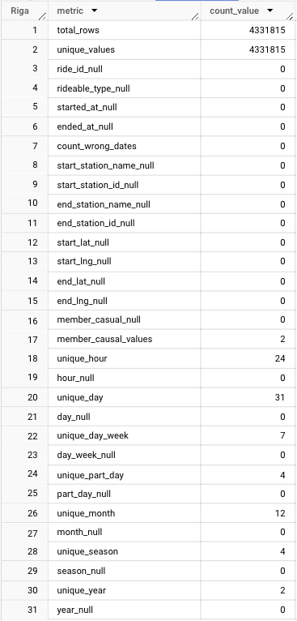

The number of unique ride id is equal to the number of rows, there are no null or misplaced values , the unique values of user types, hours, days, parts of the day, months, seasons and years are correct. 
The process of cleaning the data and preparing it for analysis has ended.

## 4) Analysis

#### Summary metrics

First of all, I conducted a set of queries that provides summarized key findings such as the total number of trips attributed to annual members and casual riders, peak demands across the day, the week and the year and the general average usage of the service.

##### Total number of trips by type of user 

<details><summary>Display SQL Query</summary>

```SQL
-- total trips per user

SELECT
  member_casual,
  COUNT(ride_id) AS no_trips
FROM
  `sigma-nimbus-418114.bike_sharing_1.cyclistic_cleaned`
GROUP BY
  member_casual
 
```
</details>

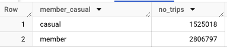

##### Peak hour for casual riders

<details><summary>Display SQL Query</summary>

```SQL
-- peak hour for casuals

SELECT
  hour,
  COUNT(ride_id) AS no_trips,
  member_casual
FROM
   `sigma-nimbus-418114.bike_sharing_1.cyclistic_cleaned`
WHERE
  member_casual = 'casual'
GROUP BY
  hour,
  member_casual
ORDER BY
  COUNT(ride_id) DESC
LIMIT 1
```
</details>

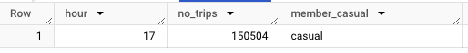

##### Peak hour for annual members

<details><summary>Display SQL Query</summary>

```SQL
-- peak hour for members

SELECT
  hour,
  COUNT(ride_id) AS no_trips,
  member_casual
FROM
   `sigma-nimbus-418114.bike_sharing_1.cyclistic_cleaned`
WHERE
  member_casual = 'member'
GROUP BY
  hour,
  member_casual
ORDER BY
  COUNT(ride_id) DESC
LIMIT 1
```
</details>

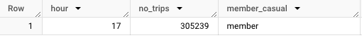

##### Peak time by parts of the day for casual riders

<details><summary>Display SQL Query</summary>

```SQL
-- peak part of day casual

SELECT
  part_of_day,
  COUNT(ride_id) AS no_trips,
  member_casual
FROM
   `sigma-nimbus-418114.bike_sharing_1.cyclistic_cleaned`
WHERE
  member_casual = 'casual'
GROUP BY
  part_of_day,
  member_casual
ORDER BY
  COUNT(ride_id) DESC
LIMIT 1
  
```
</details>

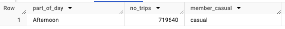

##### Peak time by parts of the day for annual members

<details><summary>Display SQL Query</summary>

```SQL
-- peak part of day members

SELECT
  part_of_day,
  COUNT(ride_id) AS no_trips,
  member_casual
FROM
   `sigma-nimbus-418114.bike_sharing_1.cyclistic_cleaned`
WHERE
  member_casual = 'member'
GROUP BY
  part_of_day,
  member_casual
ORDER BY
  COUNT(ride_id) DESC
LIMIT 1
  
```
</details>

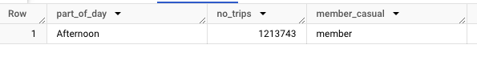

##### Peak during the week for casual riders

<details><summary>Display SQL Query</summary>

```SQL
-- peak day of the week for casuals

SELECT
  day_of_week,
  COUNT(ride_id) AS no_trips,
  member_casual
FROM
   `sigma-nimbus-418114.bike_sharing_1.cyclistic_cleaned`
WHERE
  member_casual = 'casual'
GROUP BY
  day_of_week,
  member_casual
ORDER BY
  COUNT(ride_id) DESC
LIMIT 1
  
```
</details>

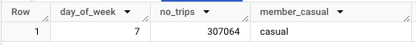

##### Peak during the week for annual members

<details><summary>Display SQL Query</summary>

```SQL
-- peak day of the week for members

SELECT
  day_of_week,
  COUNT(ride_id) AS no_trips,
  member_casual
FROM
   `sigma-nimbus-418114.bike_sharing_1.cyclistic_cleaned`
WHERE
  member_casual = 'member'
GROUP BY
  day_of_week,
  member_casual
ORDER BY
  COUNT(ride_id) DESC
LIMIT 1
  
```
</details>

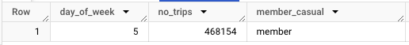

##### Peak month for casual riders

<details><summary>Display SQL Query</summary>

```SQL
-- peak month for casuals

SELECT
  month,
  COUNT(ride_id) AS no_trips,
  member_casual
FROM
   `sigma-nimbus-418114.bike_sharing_1.cyclistic_cleaned`
WHERE
  member_casual = 'casual'
GROUP BY
  month,
  member_casual
ORDER BY
  COUNT(ride_id) DESC
LIMIT 1

```
</details>


##### Peak month for annual member

<details><summary>Display SQL Query</summary>

```SQL
-- peak month for member

SELECT
  month,
  COUNT(ride_id) AS no_trips,
  member_casual
FROM
   `sigma-nimbus-418114.bike_sharing_1.cyclistic_cleaned`
WHERE
  member_casual = 'member'
GROUP BY
  month,
  member_casual
ORDER BY
  COUNT(ride_id) DESC
LIMIT 1
  
```
</details>

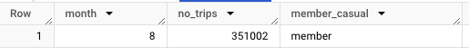

##### Peak season for casual riders

<details><summary>Display SQL Query</summary>

```SQL
-- peak season for casuals

SELECT
  season,
  COUNT(ride_id) AS no_trips,
  member_casual
FROM
   `sigma-nimbus-418114.bike_sharing_1.cyclistic_cleaned`
WHERE
  member_casual = 'casual'
GROUP BY
  season,
  member_casual
ORDER BY
  COUNT(ride_id) DESC
LIMIT 1
  
```
</details>

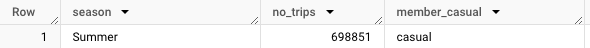

##### Peak season for annual members

<details><summary>Display SQL Query</summary>

```SQL
-- peak season for members

SELECT
  season,
  COUNT(ride_id) AS no_trips,
  member_casual
FROM
   `sigma-nimbus-418114.bike_sharing_1.cyclistic_cleaned`
WHERE
  member_casual = 'member'
GROUP BY
  season,
  member_casual
ORDER BY
  COUNT(ride_id) DESC
LIMIT 1
  
```
</details>

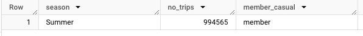

##### Average duration of the trip

<details><summary>Display SQL Query</summary>

```SQL
-- average duration by user type

SELECT
  member_casual,
  AVG(travel_time) AS avg_travel_time
FROM
  `sigma-nimbus-418114.bike_sharing_1.cyclistic_cleaned`
GROUP BY
  member_casual

```
</details>

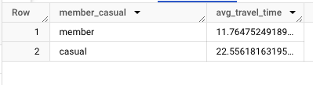

Based on the results gained:
- the total amount of trips attributed to casual riders is 1525018; for annual members the number is 2806797;
- the peak hour for both casual riders and annual members is 17:00;
- the peak during the day for both casual riders and annual members is during the afternoon;
- the peak during the week is in Saturday for casual riders, in Thursday for annual members;
- the peak season is summer for both the user types;
- the peak month for casual riders is in July, for annual members is in August;
- the general average duration is 23 minutes for casual riders, 12 minutes for annual members. 


#### Amount of trips during the day

I want to extract the amount of trips for every hour of the day 

<details><summary>Display SQL Query</summary>

```SQL
-- number of trips by hour and user type

SELECT
  hour,
  member_casual,
  COUNT(ride_id) AS no_trips
FROM
  `sigma-nimbus-418114.bike_sharing_1.cyclistic_cleaned`
GROUP BY
  hour,
  member_casual
ORDER BY
  hour,
  member_casual
```
</details>

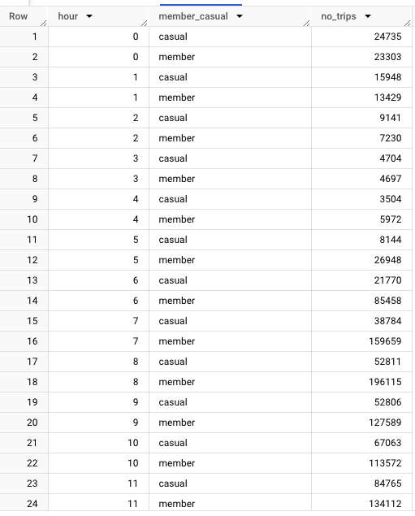
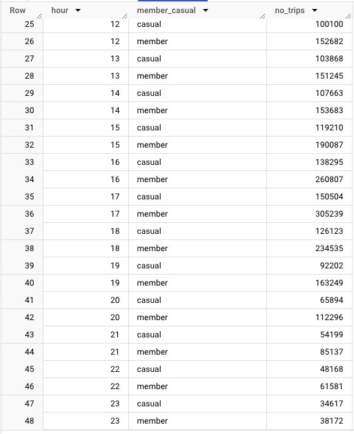

The results show that, in general, the time slot from 14:00 to 19:00 his the one with the highest demand of the service.
In particular, casual riders demand grows until the peak at 17:00. The high numbers between 14:00 and 19:00 could be related to a recreative use by this type of users.
Annual members, instead, cause a higher demand in the early morning, with a peak at 8:00, and in the afternoon with a more relevant peak at 17:00; that could be related to a more relevant use for commuting to workplace.

#### Amount of trips during the week

I want to extract the number of trips for every day of the week, distinguishing the type of user.

<details><summary>Display SQL Query</summary>

```SQL
-- number of trips by day of the week and user type

SELECT
  day_of_week,
  member_casual,
  COUNT(ride_id) AS no_trips
FROM
  `sigma-nimbus-418114.bike_sharing_1.cyclistic_cleaned`
GROUP BY
  day_of_week,
  member_casual
ORDER BY
  day_of_week,
  member_casual

```
</details>

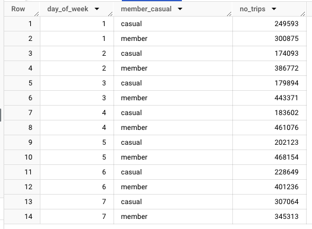

The results show that the trips made by casual riders increase in the week-end, with a peak in Saturday; the annual members use the service especially from Monday to Thursday.
That's another evidence of the assumption that a relevant number of annual members use the service for commuting to the workplace, while casual riders use the same service for recreational purposes.


#### Amount of trips during the year

I want to extract the number of trips for every month, distinguishing the type of user.

<details><summary>Display SQL Query</summary>

```SQL
-- number of trips per month by user type

SELECT
  year,
  month,
  member_casual,
  COUNT(ride_id) AS no_trips
FROM
  `sigma-nimbus-418114.bike_sharing_1.cyclistic_cleaned`
GROUP BY
  year,
  month,
  member_casual
ORDER BY
  year,
  month,
  member_casual
  
```
</details>

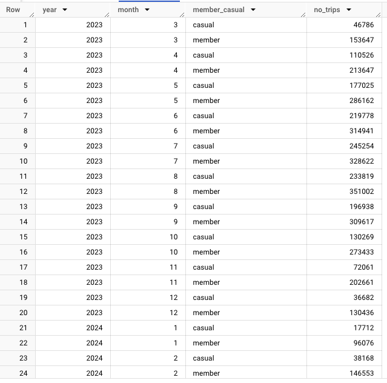

The annual trend is similar between the two type of user. The result of the query show an increase from spring to summer. This is probably due to the best weather conditions that facilitate the use for both commuting to work and recreational purposes.


#### Average duration of the trips during the day

<details><summary>Display SQL Query</summary>

```SQL
-- average duration during the day

SELECT
  hour,
  member_casual,
  AVG(travel_time) AS avg_travel_time
FROM
  `sigma-nimbus-418114.bike_sharing_1.cyclistic_cleaned`
GROUP BY
  hour,
  member_casual
ORDER BY
  hour,
  member_casual

```
</details>

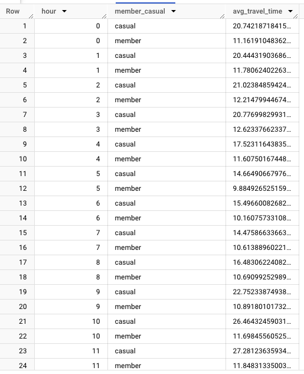
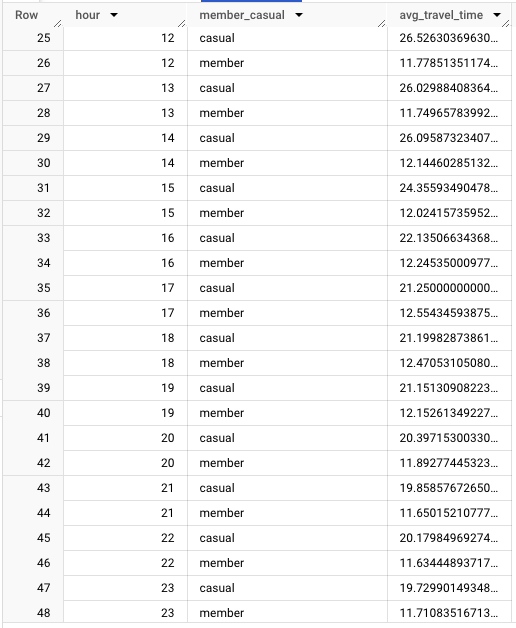

The average amount of minutes spent on trips by member users is quite constant during the day, with a slight decrease in the late night.
The average amount of minutes spent on trips by casual riders, instead, is much more variable, with an increase during the morning, and high values until 15:00; furthermore, it is noteworthy that the average duration of casual riders is always higher than the average duration of member users.

#### Average duration of the trips during the week

<details><summary>Display SQL Query</summary>

```SQL
-- average duration during the week by user type

SELECT
  day_of_week,
  member_casual,
  AVG(travel_time) AS avg_travel_time
FROM
  `sigma-nimbus-418114.bike_sharing_1.cyclistic_cleaned`
GROUP BY
  day_of_week,
  member_casual
ORDER BY
  day_of_week,
  member_casual

```
</details>

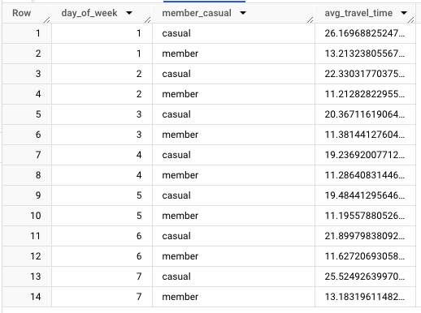

Also in this case the average duration of the trips of member users is quite constant, with a slight increase during the weekend.
The average duration of casual riders present a higher variability and a stronger increase during the week. It is possible that the longer average duration is associated with an higher amount of trips with recreational purposes.

#### Average duration of the trips during the year

<details><summary>Display SQL Query</summary>

```SQL
-- monthly average duration by user type

SELECT
  year,
  month,
  member_casual,
  AVG(travel_time) AS avg_travel_time
FROM
  `sigma-nimbus-418114.bike_sharing_1.cyclistic_cleaned`
GROUP BY
  year,
  month,
  member_casual
ORDER BY
  year, 
  month,
  member_casual

```
</details>

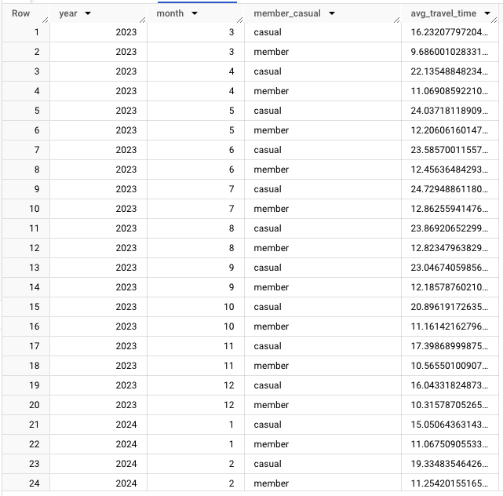

The average duration of the trips made by member users is quite constant during the entire observation period.
As for casual riders, the results show an increase especially in the warmer months; in general, the average duration of the trips is always higher than that of member users.

#### Busiest stations

To get the busiest stations I set a Query in which, first of all, it is defined a CTE (Common Table Expression) which calculate the number of trips for every combination of user and starting station, and give a number of row based on the number of trips by the type of user in descending order.
The second part of the query selects the first 10 rows, which correspond to the 10 busiest stations.

##### Top 10 busiest starting stations

<details><summary>Display SQL Query</summary>

```SQL
WITH utilized_stations AS -- defining the CTE to calculate number of trips for every combination of user and starting station, and sort them in descending order.
(
  SELECT
    member_casual,
    start_station_name,
    start_lat,
    start_lng,
    COUNT(ride_id) AS no_trips,
    ROW_NUMBER() OVER (PARTITION BY member_casual ORDER BY COUNT(ride_id) DESC) as classification -- this chunk gives a number of row based on the amount of trips by type of user in descending order.
  FROM
    `sigma-nimbus-418114.bike_sharing_1.cyclistic_cleaned`
  GROUP BY
    member_casual,
    start_station_name,
    start_lat,
    start_lng
)
SELECT -- filtering the first 10 busiest stations
  member_casual,
  start_station_name,
  start_lat,
  start_lng,
  no_trips
FROM
  utilized_stations
WHERE
classification <= 10 

```
</details>

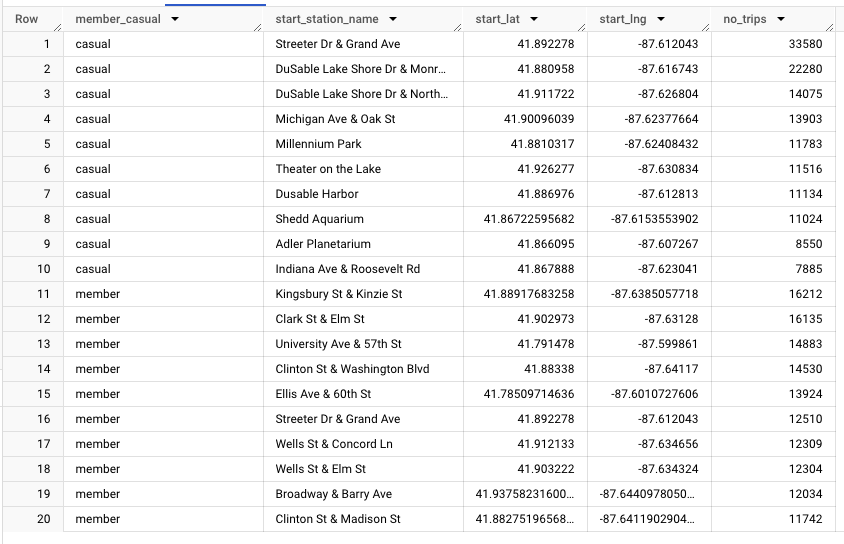

I repeat the process for the arrival stations.

##### Top 10 busiest arrival stations

<details><summary>Display SQL Query</summary>

```SQL
WITH utilized_stations AS -- defining the CTE to calculate number of trips for every combination of user and arrival station, and sort them in descending order.
(
  SELECT 
    member_casual,
    end_station_name,
    end_lat,
    end_lng,
    COUNT(ride_id) AS no_trips,
    ROW_NUMBER() OVER (PARTITION BY member_casual ORDER BY COUNT(ride_id) DESC) as classification -- this chunk gives a number of row based on the amount of trips by type of user in descending order.
  FROM
    `sigma-nimbus-418114.bike_sharing_1.cyclistic_cleaned`
  GROUP BY
    member_casual,
    end_station_name,
    end_lat,
    end_lng
)
SELECT -- filtering the first 10 busiest stations
  member_casual,
  end_station_name,
  end_lat,
  end_lng,
  no_trips
FROM
  utilized_stations
WHERE
classification <= 10 
```
</details>

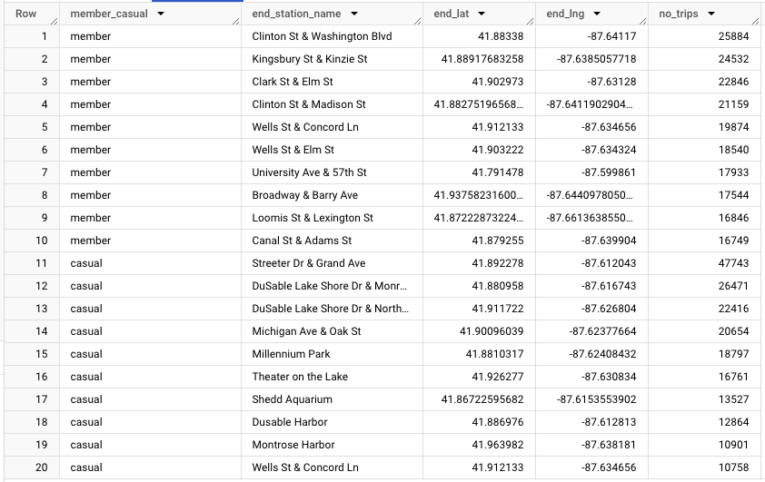

Regarding annual members, results further support the assumption that there is a high portion of them who use the service for communting to work. Some of the busiest stations by this type of user include places close to universities, suggesting that there is also a relevant component of students.
As for causal riders, again results support the assumption that a high component of trips has recreational purposes. In particular, the busiest stations by this type of user are located nearby the city attractions or the lake front.

##### Usage of the different types of bikes by user types

<details><summary>Display SQL Query</summary>

```SQL
-- number of trips by bike and user types

SELECT
  member_casual,
  rideable_type,
  COUNT(rideable_type) AS no_trips
FROM
  `sigma-nimbus-418114.bike_sharing_1.cyclistic_cleaned`
GROUP BY
  member_casual,
  rideable_type
 
```
</details>

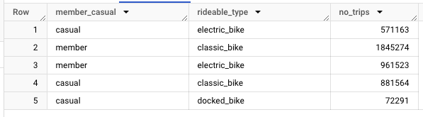

Classic bike is way preferred by annual members, it's usage is around twice that of casual riders. The proportions are more balanced as regards the use of electric bikes. finally, it should be noted that only a small part of casual riders use docked bikes.

## 5) Share

In this phase I used the results of the analysis to build a presentation where the insights are highlighted in an appealing way.
The presentation consists of 6 slides:
1) Cover: displays the subject of the work done.
2) Scenario: a summary of the context in which the analysis is conducted.
3) Analysis: a series of visualizations regarding the summary metrics (total trips by types of user, peaks across part of the day, days of the week, seasons, the general average duration), volume trends (amount of trip during the day, the week, the year; amount of trips by bike type), busiest stations, average duration trends (during the day, the week and the year). I choose to not show in the presentation the visualization about the peaks month and hours of the day, because are already shown in the graphs and I wanted to avoid overload the slides with redundant informations. 
4) Interpretation: a sum up of what analysis suggests, and the elements supporting the assumptions.
5) Advices: a list of possible follow-up actions based on the results of the analysis and some recommendations for further analysis.
6) Acknowledgments: sources from which data and elements of the presentation were taken, and thanking for the attention.

To see the presentation, clik [here](https://public.tableau.com/views/cyclistic-inprogress/Dashboard2?:language=it-IT&:sid=&:display_count=n&:origin=viz_share_link)

## 6) Act

The general goal of the analysis is to provide support to a data-driven decision-making, which means that the discovery of facts throught data analysis should be used to guide business strategy.  
As shown in the presentation, the analysis leads to some possible actions that can be taken in order to achieve the goal of converting casual riders into members (and, by doing this, ensuring future growth for the company):
- The introduction of a seasonal membership for those who prefer ride especially during the summer, or during spring and summer;
- a membership valid for the use of some of the stations, or specifically those close to major points of interest in the city
- an "afternoon membership" for those who prefer ride in the afternoon;
- a "weekend membership" for those who prefer ride during the weekend;
- combinations of these new subcriptions.

Future discussions with the Marketing department can help to better define these actions in order to optimize their effectiveness.

As a last suggestion, these findings could be expanded by analysing the itineraries (from a certain start station to a certain end station) and conducting a more in-depth investigation about hours and days with higher demand during the spring and summer.


